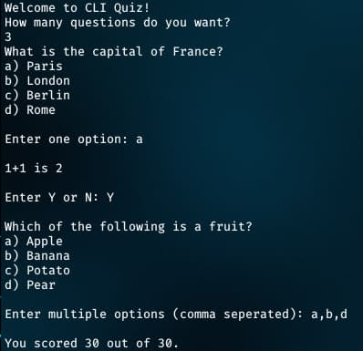

<div align = "center">

<h1><a href="https://2kabhishek.github.io/cli-quiz">CLI Quiz</a></h1>

<a href="https://github.com/2KAbhishek/cli-quiz/blob/main/LICENSE">
 </a>

<a href="https://github.com/2KAbhishek/cli-quiz/pulse">
 </a>

<a href="https://github.com/2KAbhishek/cli-quiz/stargazers">
</a>

<a href="https://github.com/2KAbhishek/cli-quiz/network/members">
 </a>

<a href="https://github.com/2KAbhishek/cli-quiz/watchers">
 </a>

<a href="https://github.com/2KAbhishek/cli-quiz/graphs/contributors">
 </a>

<a href="https://github.com/2KAbhishek?tab=followers">
 </a>

<h3>Create quizzes on the CLI ❔📑</h3>

<figure>
  
  <br/>
  <figcaption>cli-quiz screenshot</figcaption>
</figure>

</div>

## What is this

CLI Quiz is a tiny framework that allows you to easily create command line quiz apps.

## Inspiration

Was trying out some online quizzes, thought I'd make one myself.

## Prerequisites

Before you begin, ensure you have met the following requirements:

- You have installed the latest version of `java`

## Getting cli-quiz

To install cli-quiz, follow these steps:

```bash
git clone https://github.com/2kabhishek/cli-quiz
cd cli-quiz/src
```

## Using cli-quiz

The quiz supports different types of questions

- MCQs
- True and False
- Numericals

You can create the questions in `QuestionBank.java`.
`Quiz.java` has the main method, compile it and run to start the quiz.

```bash
# After making changes
java Quiz.java
# Starting the quiz
java Quiz
```
Can be used as a case study for OOP principles.

## How it was built

cli-quiz was built using `java` and `neovim`

## What I learned

- Figuring out all the different question types and there implementation was fun.

Hit the ⭐ button if you found this useful.

## More Info

<div align="center">

<a href="https://github.com/2KAbhishek/cli-quiz">Source</a> | <a href="https://2kabhishek.github.io/cli-quiz">Website</a>

</div>
